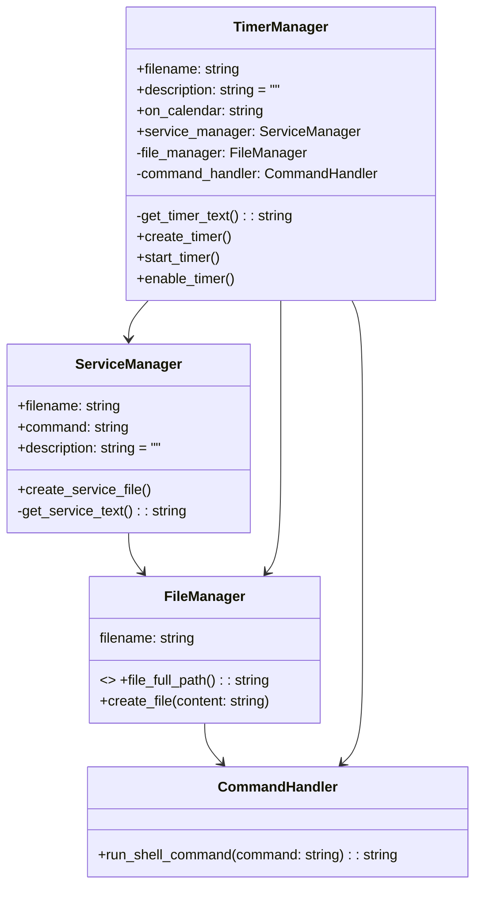

# SchedulerX

## Authors

- [@hakkm](https://www.github.com/hakkm)

## Installation

```pip install schedulerx```

<!-- ## Usage/Examples -->
<!---->
<!-- For simple usage, you have to know how to set [onCalendar in systemd](https://wiki.archlinux.org/title/systemd/Timers) -->
<!---->
<!-- ```python3 -->
<!-- from schedulerx import SimpleScheduler -->
<!---->
<!-- scheduler = SimpleScheduler( -->
<!--     title="shutdown at midnight", -->
<!--     command="shutdown now", -->
<!--     on_calendar=@daily -->
<!-- ) -->
<!---->
<!-- scheduler.schedule() -->
<!-- ``` -->

<!-- for more complex usage you have to know about how we create a timer and a service in systemd   -->
<!-- And then you can use ServiceTimerManager -->
<!---->
<!-- ```python3 -->
<!-- from schedulerx import ServiceTimerManager -->
<!---->
<!-- service_timer = ServiceTimerManager( -->
<!--     service_filename="shutdown.service", -->
<!--     service_description="shutdown at midnight", -->
<!--     command="shutdown now", -->
<!--     timer_filename="shutdown.timer", -->
<!--     timer_description="shutdown at midnight timer", -->
<!--     on_calendar="@daily", -->
<!-- ) -->
<!---->
<!-- service_timer.schedule() -->
<!-- ``` -->

## License

[MIT](https://choosealicense.com/licenses/mit/)


## Class Diagram of SchedulerX


